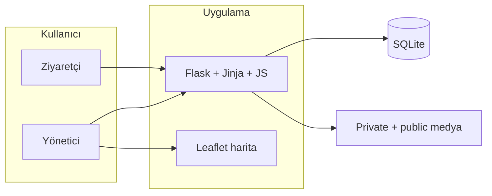

<div align="center">

# Ali Baba'nın Çiftliği

**Kapadokya / Ürgüp** — oğul ve sabit kovanları **haritada yönetmek** ve çiftliği ziyaretçilere açmak için geliştirilmiş tek sunucu web uygulaması.

Public bilgi sayfaları, ziyaretçi mesajları ve yönetim paneli **tek kod tabanında** toplanır.

[](https://www.python.org/)
[](https://flask.palletsprojects.com/)
[](https://www.sqlite.org/)
[](https://docs.docker.com/compose/)

</div>

---

> **Güvenlik**  
> Admin paneli kovan/arılık **konum verisi** ve özel kovan fotoğrafları tutar. Public sayfalar internete açılabilir; admin için yalnızca güçlü parolaya güvenmeyin — Nginx Proxy Manager access list, basic auth, VPN veya yerel ağ gibi **ikinci bir erişim katmanı** kullanın.  
> Varsayılan geliştirme şifresi `alibaba`dır; Docker/production modunda güvensiz parolalarla uygulama **başlamaz**.

---

## İçindekiler

| | |
|:--|:--|
| 1 | [Ne sunuyor?](#ne-sunuyor) |
| 2 | [Mimari (özet)](#mimari-özet) |
| 3 | [Hızlı başlangıç](#hızlı-başlangıç-geliştirme) |
| 4 | [Ortam değişkenleri](#ortam-değişkenleri) |
| 5 | [Docker ve NPM](#docker-ve-ters-vekil-npm) |
| 6 | [Yedekleme ve dışa aktarma](#yedekleme-ve-dışa-aktarma) |
| 7 | [URL özeti](#url-özeti-public--korumalı) |
| 8 | [Test](#test) |
| 9 | [Teknolojiler](#teknolojiler-ve-bağımlılıklar) |
| 10 | [Sınırlamalar ve ipuçları](#bilinen-sınırlamalar-ve-ipuçları) |
| 11 | [Yol haritası](#gelecek-planlar) |
| 12 | [Lisans](#lisans) |

---

## Ne sunuyor?

<table>
<tr>
<td width="50%" valign="top">

### Web (herkese açık)

- Ana sayfa, **günlük** (`/gunluk`), ziyaretçi mesajı, **bal hikayeleri**
- Kovan üstü QR için public karşılama ve kovan kaynaklı mesaj bırakma akışı
- Oğul/sabit kovan **konumları** public tarafta gösterilmez
- **PWA:** manifest + service worker, `/offline` yedek sayfa
- Public görseller: `/public-media/...`

</td>
<td width="50%" valign="top">

### Panel (giriş gerekir)

- **Oğul kovanları:** liste, EXIF/tarayıcı GPS, harita, foto, durum
- **Sabit arılıklar:** grid/kroki, kovan detayı, **QR**, kontrol geçmişi
- **Harita:** Leaflet, katmanlar, yol tarifi, eski kontrol uyarıları
- **Yedek / dışa aktarma:** zip yedek, CSV ve Excel indirme
- **API:** `GET /api/map-data` (oturumlu)

</td>
</tr>
</table>

<details>
<summary><strong>Uygulama içi güvenlik (özet)</strong></summary>

- Oturum tabanlı giriş; `POST`/`PUT`/`PATCH`/`DELETE` isteklerinde **CSRF**
- Private foto ve QR, yalnızca giriş sonrası route’lardan
- Yüklenen görseller Pillow ile kaydedilir; **EXIF/GPS dosyada tutulmaz**
- Ters vekil için `ALI_BABA_PROXY_FIX=1` → `ProxyFix` (Docker varsayılanı)

</details>

---

## Mimari (özet)



| Bileşen | Açıklama |
|--------|----------|
| **Sunucu** | Python 3, Flask 3.x |
| **Üretim** | Gunicorn (Docker `CMD`) |
| **Veri** | SQLite (`ALI_BABA_DB_PATH`; Docker’da kalıcı volume önerilir) |
| **Dosyalar** | Private foto, QR, public içerik ayrı klasörlerde |
| **Ön yüz** | Jinja, sunucu formları, vanilla JS, Leaflet |

**Önemli dosyalar:** `app.py` (rotalar), `init_db.py` (şema + örnek veri), `tests/`.

---

## Hızlı başlangıç (geliştirme)

| Adım | Ne yapılır? |
|------|-------------|
| 1 | `python -m venv venv` → `source venv/bin/activate` (Windows: `venv\Scripts\activate`) |
| 2 | `pip install -r requirements.txt` |
| 3 | `python init_db.py` |
| 4 | `python app.py` |

```bash
cd ali_babanin_ciftligi
python -m venv venv
source venv/bin/activate   # Windows: venv\Scripts\activate
pip install -r requirements.txt
python init_db.py
python app.py
```

- Varsayılan: **`http://127.0.0.1:5000`**
- Aynı ağdan (QR testi) için: `ALI_BABA_HOST=0.0.0.0` ve makinenin yerel IP’si
- `init_db.py` çalıştırılmazsa `app.py` tek başına uyarı verir

**Gereksinim:** Python 3.10+ önerilir (Docker imajı 3.12 kullanır).

---

## Ortam değişkenleri

| Değişken | Açıklama | Örnek / varsayılan |
|----------|----------|--------------------|
| `ALI_BABA_PASSWORD` | Giriş parolası | Geliştirme: `alibaba` — **üretimde değiştirin** |
| `ALI_BABA_SECRET_KEY` | Flask oturum imzası | Rastgele uzun dize; yoksa her başlangıçta yeni (oturumlar sıfırlanır) |
| `ALI_BABA_HOST` | Geliştirme sunucusu | `127.0.0.1`; ağ için `0.0.0.0` |
| `ALI_BABA_PORT` | Port | Geliştirme: `5000`; Docker örneği: `51847` |
| `ALI_BABA_DEBUG` | Flask debug | `0` veya `1` |
| `ALI_BABA_DB_PATH` | SQLite yolu | `ali_baba.db` veya `/data/ali_baba.db` |
| `ALI_BABA_UPLOAD_FOLDER` | Private kovan/kontrol foto | `uploads` veya `/data/uploads` |
| `ALI_BABA_QR_FOLDER` | Private QR | `qrcodes` veya `/data/qrcodes` |
| `ALI_BABA_PUBLIC_UPLOAD_FOLDER` | Public günlük/bal görselleri | `public_uploads` veya `/data/public_uploads` |
| `ALI_BABA_BACKUP_FOLDER` | Zip yedek dosyaları | DB klasörü altında `backups`; Docker’da `/data/backups` |
| `ALI_BABA_PUBLIC_URL` | Dış domain (opsiyonel) | Son `/` olmadan |
| `ALI_BABA_PROXY_FIX` | `ProxyFix` (X-Forwarded-*) | Docker’da `1` |
| `ALI_BABA_REQUIRE_SECURE_PASSWORD` | Zayıf prod parolalarını reddeder | Docker’da `1` |
| `ALI_BABA_SESSION_COOKIE_SECURE` | Oturum çerezini yalnız HTTPS’te gönderir | `PUBLIC_URL` `https://` ise varsayılan `1`; lokal HTTP için `0` |
| `ALI_BABA_LOGIN_FAILED_RATE_LIMIT` | IP başına hatalı giriş denemesi sınırı | `8` |
| `ALI_BABA_LOGIN_FAILED_RATE_WINDOW` | Hatalı giriş limiti zaman penceresi (saniye) | `900` |
| `ALI_BABA_PUBLIC_MESSAGE_RATE_LIMIT` | IP başına public mesaj gönderim sınırı | `5` |
| `ALI_BABA_PUBLIC_MESSAGE_RATE_WINDOW` | Public mesaj limiti zaman penceresi (saniye) | `600` |
| `ALI_BABA_MAX_IMAGE_PIXELS` | Yüklenen görseller için en yüksek piksel sayısı | `25000000` |
| `GUNICORN_WORKERS` | Gunicorn işçi sayısı | `2` |
| `ALI_BABA_ASSET_VERSION` | Önbellek kırma (opsiyonel) | Boşsa mtime’dan türetilir |

**Güvenli gizli anahtar:**

```bash
python -c "import secrets; print(secrets.token_hex(32))"
```

**Windows PowerShell (örnek):**

```powershell
$env:ALI_BABA_HOST = "0.0.0.0"
$env:ALI_BABA_PASSWORD = "güçlü-parola"
python app.py
```

---

## Docker ve ters vekil (NPM)

Proje **Nginx Proxy Manager** ile aynı Docker ağına göre örüklü. Uygulama portu `51847`; NPM hedefi `ali-baba-ciftligi:51847` olmalı.

| # | Adım |
|---|------|
| 1 | `cp .env.example .env` — en az `ALI_BABA_PASSWORD`, `ALI_BABA_SECRET_KEY` (ve isteğe `ALI_BABA_PUBLIC_URL`, `ALI_BABA_PORT`) |
| 2 | NPM ağı yoksa: `docker network create npm-net` |
| 3 | `docker compose up -d --build` |

Compose; DB, private foto, QR ve public görseller için **named volume** oluşturur.

**NPM proxy host (özet):**

| Alan | Değer |
|------|--------|
| Domain | Kendi alan adınız |
| Şema | `http` → konteyner |
| Forward hostname | `ali-baba-ciftligi` |
| Port | `51847` |
| SSL | Let’s Encrypt vb.; “Force SSL” açık olabilir |

`docker-compose.yml` içinde `ALI_BABA_PROXY_FIX=1`, kalıcı yollar ve `ALI_BABA_REQUIRE_SECURE_PASSWORD=1` tanımlıdır.

**Yerel üretim (Docker’sız):** `gunicorn` ile `app:app` + ortam değişkenleri + ilk kurulumda `init_db`.

---

## Yedekleme ve dışa aktarma

Admin girişi sonrası:

- **Yedekleme:** `/admin/backups` sayfasından **Yeni Yedek Al** ile `ali_baba_backup_YYYYMMDD_HHMMSS.zip` dosyası oluşturulur. Son 10 yedek saklanır; daha eskiler otomatik silinir.
- **Yedek içeriği:** SQLite veritabanı, `uploads`, `qrcodes` ve varsa `public_uploads` klasörü.
- **Yedek konumu:** Lokal çalışmada varsayılan olarak veritabanı klasörü altındaki `backups`; Docker’da `/data/backups`.
- **Docker volume:** `ali_baba_data` volume’u `/data` altındaki `ali_baba.db` ve `backups` klasörünü tutar. Ayrıca `ali_baba_uploads`, `ali_baba_qrcodes`, `ali_baba_public_uploads` volume’ları medya dosyaları içindir.
- **Dışa aktarma:** `/admin/export` sayfasından Oğul Kovanları, Sabit Kovanlar, Kontrol Kayıtları ve Arılık Özeti için CSV veya Excel indirilebilir. Excel çıktıları filtrelenebilir/sıralanabilir tablo formatındadır; Google Maps konum sütunları tıklanabilir link olarak gelir. Tüm Veriler Excel (`all.xlsx`) çıktısı aynı dosyada ayrı sayfalar halinde gelir.

Yedek ve dışa aktarma dosyaları konum, kovan ve özel notlar gibi hassas veri içerir; paylaşılmamalı ve güvenli bir yerde saklanmalıdır.

---

## URL özeti (public / korumalı)

| Alan | Örnek yollar |
|------|----------------|
| **Public** | `/`, `/mesaj-birak`, `/q/fixed/<id>`, `/q/swarm/<id>`, `/fixed-hives/<id>` ve `/swarm-hives/<id>` için girişsiz QR ekranı, `/gunluk`, `/bal-hikayeleri`, `/bal-hikayeleri/<id>`, `/public-media/<dosya>`, `/offline`, `/manifest.webmanifest`, `/sw.js` |
| **Giriş** | `/login`, `/logout` |
| **Panel** | `/admin`, `/admin/messages`, `/admin/content`, `/admin/posts`, `/admin/honey-stories`, `/admin/backups`, `/admin/export` … |
| **Harita / veri (oturum)** | `/admin/hives` ve ilgili rotalar, `/media/uploads/<dosya>`, `/media/qrcodes/<dosya>`, `GET /api/map-data` |

Tüm rotalar: `app.py` içindeki `@app.route` tanımları.

---

## Test

```bash
python -m unittest discover -s tests
```

---

## Teknolojiler ve bağımlılıklar

- **Flask** 3.x, **Gunicorn** (üretim)  
- **SQLite** 3 (stdlib)  
- **Pillow** (EXIF’ten GPS), **qrcode**, **openpyxl**
- **Leaflet** + döşemeler (OSM ve ek katmanlar)  

Sürümler: `requirements.txt`

---

## Bilinen sınırlamalar ve ipuçları

- **QR:** URL’ler `request.host_url` / `ALI_BABA_PUBLIC_URL` ile üretilir. Sadece `http://localhost:…` ile açarsanız, telefondaki **localhost cihazın kendisidir**; QR çalışmaz. Aynı Wi‑Fi’de `http://192.168.x.x:port` veya dışarıdan erişilebilir adres/`ALI_BABA_PUBLIC_URL` kullanın.  
- **Güvenlik:** Tek parola; çoklu kullanıcı/rol yok. Hassas veri için VPN, ağ kısıtı veya ters vekilde ek koruma düşünün.  
- **PWA:** Public tarafta temel destek; tam offline deneyim ileride genişletilebilir.

---

## Gelecek planlar

- [ ] Kullanıcı yönetimi ve daha ayrıntılı yetkilendirme  
- [ ] PWA / çevrimdışı deneyimini genişletme  
- [ ] Harita karosu: çevrimdışı veya kendi karo sunucusu  
- [ ] Bildirim veya e‑posta hatırlatma (kontrol tarihleri)  

---

## Lisans

Bu proje **özel kullanım** içindir.
